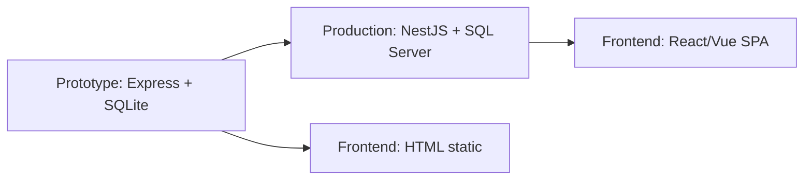

# ADR-002: Stack Selection for Prototype Phase

## Status
Accepted (2026-06-06)

## Context
Need to build a runnable prototype for M01 (User Management) to validate the local dev workflow before scaling to all 11 modules. Key requirements:
- Must build and run on Mac via Docker
- User needs to see login + CRUD screens working in browser
- Must be fast to iterate (prototype speed, not production perfection)

## Decision

| Layer | Choice | Why |
|-------|--------|-----|
| Backend | **Express.js** (Node 22) | Simplest JS backend, fastest to setup. NestJS overkill for prototype |
| Database | **SQLite** (better-sqlite3) | Zero config: no server needed, file-based, portable. Can swap to SQL Server later |
| Frontend | **Static HTML** (from `docs/ui/`) | Already have 11 module HTML files. Served directly by Express. No build step needed |
| Auth | **JWT** (jsonwebtoken) | Stateless, easy to integrate with HTML frontend |
| Password | **bcryptjs** | Standard hash, no native deps needed |
| Container | **Docker compose** | Single `docker compose up` to run everything |

## Deployment Architecture

```
docker-compose.yml
└── api (Express)
    ├── src/routes/    ← API endpoints
    ├── data/           ← SQLite file (persisted)
    └── public/          ← Static HTML (mounted from docs/ui/)
```

## Consequences

### Positive
- `docker compose up` → app runs instantly on any machine with Docker
- Frontend HTML can be edited directly in `docs/ui/` and reloaded in browser (volume mount)
- SQLite means no need to install/configure SQL Server locally

### Negative
- SQLite != SQL Server — some queries (spatial, CONCAT, etc.) differ. Must account for this when migrating to production
- Static HTML frontend limited compared to React/Vue SPA. No client-side routing, no component reuse across modules
- This is a prototype stack — not recommended for production deployment

## Future Migration Path



When ready for production:
1. Backend: migrate Express → NestJS (or keep Express if team prefers)
2. Database: migrate SQLite → SQL Server (using migration script)
3. Frontend: rebuild HTML files as React/Vue components (using existing design)

## Related
- [ADR-001](ADR-001-zero-db-change.md) — Zero DB change strategy
- [Execution Plan](../sdlc/00-EXECUTION-PLAN.md)
